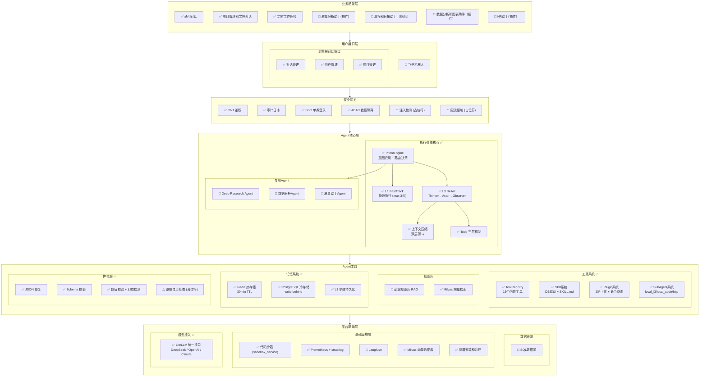

# SunnyAgent v1.0 产品规划

> **最后更新**：2026-03-11（基于代码库实际实现状态刷新）

## 产品定位

**制造业智能工作助手** — 面向企业用户的 AI 工作伴侣，提升日常办公效率，实现工作自动化。

---

## 目标用户

| 角色 | 典型场景 | 核心需求 |
|------|----------|----------|
| **质量部人员** | 客诉分析、质量追溯、8D/PDCA 报告 | 快速定位问题根因，关联历史数据 |
| **IT 开发人员** | 技术文档查询、代码辅助、数据处理 | 知识检索、自定义Skills |
| **日常办公人员** | 周报编写、数据汇总、规范查询、设置定时任务 | 提升日常处理效率 |
| **HR** | 周报编写、数据汇总、Offer生成、设置定时任务 | 提升HR系统处理效率 |

---

## v1.0 功能架构



**图例说明**：
- ✅ 已完成实现
- ⚠️ 占位符（代码存在但未实现）
- 🔲 待开发

**架构说明**：

| 层级 | 说明 | 状态 |
|------|------|------|
| **用户接口层** | Web 对话窗口、项目管理、用户管理 | ✅ 完成 |
| **安全网关** | JWT 鉴权、审计日志、SSO、ABAC 数据隔离 | ✅ 核心完成 |
| **执行引擎核心** | IntentEngine 意图路由 → L1 FastTrack / L3 ReAct 双层执行 | ✅ 完成 |
| **工具系统** | 15 个内置工具 + Skill/Plugin/SubAgent 扩展机制 | ✅ 完成 |
| **护栏层** | JSON 修复、Schema 校验、数值校验、幻觉检测 | ✅ 完成 |
| **记忆系统** | Redis 热存储 + PostgreSQL 冷存储 + L3 步骤持久化 | ✅ 完成 |
| **定时任务** | Cron 调度、任务 CRUD、执行历史跟踪 | ✅ 完成 |
| **项目管理** | 项目 CRUD、文件管理、数据隔离 | ✅ 完成 |
| **专用 Agent** | Deep Research、数据分析、质量助手 | 🔲 待开发 |
| **知识库** | Milvus 向量检索已集成，RAG 问答待开发 | ⚠️ 部分完成 |
| **平台基础层** | LiteLLM、沙箱、Prometheus、Milvus | ✅ 完成 |

---

## Spec 规划

### 功能支持状态总览

| 层级 | 功能模块 | 状态 | Spec ID | 优先级 | 备注 |
|------|----------|------|---------|--------|------|
| **用户接口层** | 对话窗口 | ✅ 已支持 | 001 | - | api/chat.py 完整实现（非流式+SSE流式） |
| | 任务执行三层展示 | ✅ 已支持 | 003 | - | SSE 事件：thought/tool_call/tool_result/delta/finish |
| | 项目管理 (GUI) | ✅ 已支持 | 006 | - | api/projects.py + api/project_files.py |
| | 飞书机器人 | 🔲 待开发 | 012 | P2 | |
| **业务场景层** | 通用对话 | ✅ 已支持 | 001 | - | L1 FastTrack + L3 ReAct 双层执行 |
| | 项目管理和文档对话 | ✅ 已支持 | 006 | - | 项目 CRUD + 文件管理 + 数据隔离 |
| | 定时工作任务 | ✅ 已支持 | 009 | - | cron/ 模块 + cron_create/cron_manage 工具 |
| | 质量分析助手 | 🔲 待开发 | 005 | P2 | |
| | 周报生成 (Skills) | 🔲 待开发 | 006-W | P3 | |
| | 数据分析和图表生成 (Skill) | 🔲 待开发 | 019 | P2 | |
| | HR 助手 (自定义 Agent) | 🔲 待开发 | 022 | P3 | |
| **执行引擎核心** | IntentEngine (意图识别+路由) | ✅ 已支持 | 005 | - | intent/intent_engine.py 完整实现 |
| | L1 FastTrack (快速执行) | ✅ 已支持 | 005 | - | execution/l1/fast_track.py，最多3步 |
| | L3 ReAct (深度推理) | ✅ 已支持 | 005 | - | execution/l3/react_engine.py，Thinker→Actor→Observer |
| | 上下文压缩 (双层漏斗) | ✅ 已支持 | 020 | - | Level 1 内存剪枝 + Level 2 摘要截断 |
| | Todo 三层机制 | ✅ 已支持 | 005 | - | 宪法层+感知层+干预层 |
| **Agent 能力层** | 通用任务处理 Agent | ✅ 已支持 | 001 | - | L1/L3 执行引擎 |
| | Deep Research Agent | 🔲 待开发 | RES | P2 | 无专用 research agent 实现 |
| | 数据分析 Agent | 🔲 待开发 | 019 | P2 | |
| | 质量助手 Agent | 🔲 待开发 | 005-Q | P2 | |
| **Agent 基础能力** | Skill 系统 (DB驱动) | ✅ 已支持 | 010 | - | skills/service.py 完整实现 |
| | Plugin 系统 | ✅ 已支持 | 025 | - | plugins/service.py + api/plugins.py |
| | Plugin 管理 API | ✅ 已支持 | 025 | - | 上传/列表/删除 + Commands/Skills 查看 |
| | SubAgent 系统 | ✅ 已支持 | 025 | - | subagents/ 完整实现（local_l3/local_code/http） |
| | 对话式 Skill Creator | 🔲 待开发 | 024 | P2 | |
| | 插件管理界面（前端） | 🔲 待开发 | 026 | P2 | 后端 API 已完成，前端待开发 |
| | 企业知识库 (RAG) | 🔲 待开发 | 018 | P3 | Milvus 已集成，RAG 检索待开发 |
| | 对话数据跟踪和管理 | 🔲 待开发 | 013 | P2 | |
| **数据来源** | 项目文件管理 | ✅ 已支持 | 006 | - | 统一文件模型 + SHA256 去重 |
| | SQL 数据源 | 🔲 待开发 | 017 | P3 | |
| **用户权限管理** | 用户管理 | ✅ 已支持 | 002 | - | security/auth.py JWT 鉴权 |
| | 权限控制 | ✅ 已支持 | 002 | - | 角色权限（viewer/operator/manager/admin） |
| | 企业集成 SSO | ✅ 已支持 | 008 | - | CAS 认证 + 自动用户同步 + ABAC 数据隔离 |
| | ABAC 数据隔离 | ✅ 已支持 | 008 | - | 按公司/事业部隔离数据 |
| | 注入检测 | ⚠️ 占位符 | SEC | P2 | injection_detector.py Phase 2 待实现 |
| | 限流控制 | ⚠️ 占位符 | SEC | P2 | rate_limiter.py Phase 2 待实现 |
| **基础设施层** | 多 LLM 提供商支持 | ✅ 已支持 | 004 | - | LiteLLM 统一接口 |
| | 代码沙箱 | ✅ 已支持 | 001 | - | sandbox_service 独立 sidecar |
| | 向量数据库 (Milvus) | ✅ 已支持 | 018 | - | vectorstore/milvus_client.py |
| | Prometheus 可观测性 | ✅ 已支持 | 007 | - | observability/metrics.py (9个指标) |
| | 结构化日志 | ✅ 已支持 | 007 | - | structlog JSON 日志 |
| | Langfuse 集成 | 🔲 待开发 | 007 | P2 | 当前使用 Prometheus |
| | 告警机制 | ⚠️ 占位符 | 014 | P2 | alerting.py Phase 2 待实现 |
| | 部署安装和监控 | ✅ 已支持 | 014 | - | Docker Compose 部署 + 系统监控 |
| **记忆系统** | Redis 热存储 | ✅ 已支持 | - | - | memory/working_memory.py，30min TTL |
| | PostgreSQL 冷存储 | ✅ 已支持 | - | - | memory/chat_persistence.py，write-behind |
| | L3 步骤持久化 | ✅ 已支持 | - | - | db/models/chat.py L3Step 表 |
| **护栏层** | JSON 修复 | ✅ 已支持 | - | - | guardrails/json_repairer.py |
| | Schema 校验 | ✅ 已支持 | - | - | guardrails/validator.py |
| | 数值交叉校验 | ✅ 已支持 | - | - | validator/numeric_validator.py |
| | 幻觉检测 | ✅ 已支持 | - | - | validator/hallucination_detector.py |
| | 逻辑自洽检查 | ⚠️ 占位符 | - | P3 | output_validator.py Layer 3 为 stub |

### 已完成 Spec

| Spec ID | 模块名称 | 状态 | 说明 |
|---------|----------|------|------|
| **001** | Multi-Agent Chat | ✅ 完成 | 通用对话、L1/L3 双层执行、文件处理、代码沙箱 |
| **002** | 用户与对话管理 | ✅ 完成 | JWT 用户认证、角色权限控制、Redis+PG 对话历史管理 |
| **003** | 任务展示模式重设计 | ✅ 完成 | SSE 事件流（thought/tool_call/tool_result/delta/finish） |
| **004** | 统一 LLM 提供商 | ✅ 完成 | LiteLLM 统一接口，支持 OpenAI/DeepSeek 等 |
| **005** | 执行引擎核心 | ✅ 完成 | IntentEngine 意图识别 + L1 FastTrack + L3 ReAct 引擎 |
| **006** | 项目管理 | ✅ 完成 | 项目 CRUD + 文件管理 + 数据隔离 + 会话关联 |
| **008** | 企业集成 SSO | ✅ 完成 | CAS 认证 + 用户同步 + ABAC 数据隔离 + HMAC 文件下载 |
| **009** | 定时任务 | ✅ 完成 | Cron 调度 CRUD + 执行历史 + 内置 cron_create/cron_manage 工具 |
| **010** | 工具系统 | ✅ 完成 | 15 个内置工具 + ToolRegistry + tier 过滤 |
| **025** | Skill/Plugin/SubAgent | ✅ 完成 | DB 驱动 Skill + Plugin 上传/管理 API + SubAgent 三种执行模式 |
| - | 记忆系统 | ✅ 完成 | Redis 热存储 + PG 冷存储 + L3 步骤持久化 + 上下文压缩 |
| - | 护栏层 | ✅ 完成 | JSON 修复 + Schema 校验 + 数值校验 + 幻觉检测 |
| - | 可观测性 | ✅ 完成 | Prometheus 指标(9个) + structlog JSON 日志 + trace_id 链路 |

### 待完成 Spec

| Spec ID | 模块名称 | 状态 | 说明 |
|---------|----------|------|------|
| **007** | Langfuse 可观测性 | 🔲 待开发 | 当前使用 Prometheus，Langfuse 集成待实现 |
| **026** | 插件管理界面（前端） | 🔲 待开发 | 后端 API 已完成，前端 UI 待实现 |

### 统一优先级规划

> 预估工作量基于 **人工 + AI 辅助开发**（1人 + Claude Code）
>
> 💡 工作量说明：所有时间估计均为 1 人 + AI 协作模式，AI 可承担约 60-70% 的编码工作
>
> ⚠️ **依赖关系说明**：被依赖的模块优先实现，箭头表示依赖方向（A → B 表示 A 依赖 B）

---

#### P0 - 最高优先级：执行引擎核心 ✅ 已完成

> **执行引擎是系统的智能中枢**，意图识别、任务执行、工具调用都依赖它

| Spec ID | 模块名称 | 核心功能 | 状态 | 说明 |
|---------|----------|----------|------|------|
| **005** | IntentEngine | 意图识别 + 路由决策（standard_l1 / deep_l3） | ✅ 完成 | intent/intent_engine.py |
| **005** | L1 FastTrack | Bounded Loop（max 3步）+ Milvus Prompt 检索 | ✅ 完成 | execution/l1/fast_track.py |
| **005** | L3 ReAct | Thinker→Actor→Observer 编排循环（max 20步） | ✅ 完成 | execution/l3/react_engine.py |
| **005** | 上下文压缩 | 双层漏斗：Level 1 内存剪枝 + Level 2 摘要截断 | ✅ 完成 | 集成在 react_engine.py |
| **005** | Todo 三层机制 | 宪法层 + 感知层 + 干预层 | ✅ 完成 | todo/store.py + L3 prompts |
**P0 完成情况**：
- ✅ **全部完成**：IntentEngine + L1/L3 双层执行 + 上下文压缩 + Todo 机制

**当前架构**（实际实现）：
```
用户请求 → IntentEngine（意图识别+路由）
              ↓
         route == "standard_l1" → L1 FastTrack（max 3步）
         route == "deep_l3"     → L3 ReAct（Thinker→Actor→Observer，max 20步）
              ↓
         工具执行（15个内置工具 + Skill + SubAgent）
              ↓
         记忆持久化（Redis + PostgreSQL）
```

---

#### P1 - 高优先级：基础能力层 ✅ 已完成

> 被其他功能依赖的核心模块

| Spec ID | 模块名称 | 核心功能 | 状态 | 说明 |
|---------|----------|----------|------|------|
| **010** | 工具系统 | 15 个内置工具 + ToolRegistry + tier 过滤 | ✅ 完成 | 新增 cron_create、cron_manage 等工具 |
| **025** | Skill/Plugin 系统 | DB 驱动 Skill + ZIP Plugin 上传 + SubAgent | ✅ 完成 | 含管理 API（上传/列表/删除） |
| - | 记忆系统 | Redis 热存储 + PG 冷存储 + L3 步骤持久化 | ✅ 完成 | |
| **006** | 项目管理 | 项目 CRUD + 文件管理 + 会话关联 + 数据隔离 | ✅ 完成 | api/projects.py + api/project_files.py |
| **008** | 企业集成 SSO | CAS 认证 + 用户同步 + ABAC 数据隔离 | ✅ 完成 | security/login.py + services/user_sync.py |
| **009** | 定时任务 | Cron CRUD + 执行历史 + 会话关联 | ✅ 完成 | cron/ 模块 + api/cron_jobs.py |
| - | Prometheus 可观测性 | 9 个指标 + structlog 日志 + trace_id | ✅ 完成 | |

**P1 完成情况**：
- ✅ **全部完成**：工具系统、Skill/Plugin/SubAgent、记忆系统、项目管理、SSO 企业集成、定时任务、Prometheus 可观测性

---

#### P2 - 中优先级：平台能力层

> 增强平台能力，构建业务场景

| Spec ID | 模块名称 | 负责人 | 核心功能 | 人工+AI | 依赖 | 状态 |
|---------|----------|--------|----------|---------|------|------|
| **SEC** | 注入检测 | 开发者 D | 高危关键词规则 + 启发式评分 + 拦截策略 | 0.5 天 | - | ⚠️ 占位符 |
| **SEC** | 限流控制 | 开发者 D | 按角色分级限流 + Redis 滑动窗口 | 0.5 天 | - | ⚠️ 占位符 |
| **SEC** | 告警机制 | 开发者 D | 告警规则 + 通知渠道 | 1 天 | - | ⚠️ 占位符 |
| **VAL** | 逻辑自洽检查 | 开发者 A | 输出校验 Layer 3 | 1 天 | - | ⚠️ 占位符 |
| **007** | Langfuse 可观测性 | 开发者 D | Trace 追踪、Token 用量统计 | 1-2 天 | - | 🔲 待开发 |
| **026** | 插件管理界面（前端） | 开发者 A | 插件/Skill 管理前端 UI | 1 天 | 025 | 🔲 待开发 |
| **024** | 对话式 Skill Creator | 开发者 A | 通过对话创建 Skill、Skill 模板、自动生成 SKILL.md | 1-2 天 | 025 | 🔲 待开发 |
| **013** | 对话数据管理 | 开发者 D | 数据集管理、标注和评估 | 1-2 天 | 007 | 🔲 待开发 |
| **RES** | Deep Research Agent | 开发者 B | 专用研究 Agent 实现 | 1-2 天 | - | 🔲 待开发 |
| **019** | 数据分析 Agent | 待分配 | Excel/CSV 分析、图表生成、数据洞察 | 1-2 天 | 017 | 🔲 待开发 |
| **005-Q** | 质量分析助手 | 开发者 B | 客诉分析、质量追溯、8D/PDCA 报告 | 3-4 天 | 018 | 🔲 待开发 |
| **012** | 飞书机器人 | 待分配 | 飞书消息接入、对话同步 | 1-2 天 | - | 🔲 待开发 |
| **014** | 部署安装和监控 | 开发者 D | 一键部署、系统监控、告警通知 | - | - | ✅ 完成 |

**P2 说明**：
- ⚠️ 安全相关功能（注入检测、限流、告警）代码中已有占位符，Phase 2 待实现
- ⚠️ 输出校验 Layer 3 为 stub，需实现逻辑自洽检查
- 026-插件管理界面：后端 API 已完成，需开发前端 UI
- 019-数据分析 Agent 依赖 017-SQL 数据源
- 005-Q-质量分析助手 依赖 018-企业知识库
- 工作量：约 **7-10 天**（1人+AI）

---

#### P3 - 扩展功能

> 可选实现，增强用户体验和数据能力

| Spec ID | 模块名称 | 负责人 | 核心功能 | 人工+AI | 依赖 | 状态 |
|---------|----------|--------|----------|---------|------|------|
| **018** | 企业知识库 | 开发者 B | 向量存储、RAG 问答、项目文档对话 | 2-3 天 | 006 | 🔲 待开发 |
| **017** | SQL 数据源 | 待分配 | 数据源配置、连接管理、直接查询 | 1-2 天 | - | 🔲 待开发 |
| **022** | HR 助手示例 | 待分配 | 自定义 Agent 示例（Offer 生成等） | 0.5-1 天 | 010 | 🔲 待开发 |
| **006-W** | 周报生成 Skills | 待分配 | 周报模板、自动汇总、多格式导出 | 0.5 天 | 005 | 🔲 待开发 |

**P3 说明**：
- 018-知识库 依赖 006-项目管理
- 005-质量分析助手 依赖 018-企业知识库
- 工作量：约 **4-6 天**（1人+AI）

---

---

#### 依赖关系图

```
P0 (执行引擎) ✅            P1 (基础能力) ✅            P2 (平台能力)              P3 (扩展功能)
─────────────              ─────────────              ─────────────              ─────────────
                           006-项目管理 ✅ ──┐
                           008-SSO ✅             │
                           009-定时任务 ✅         │
                                                  │
执行引擎核心 ──┬──────────► 025-Plugin API ✅ ────────► 026-Plugin UI(前端)
    ✅         │                                  │     024-Skill Creator
               │                                  │     014-部署监控 ✅
               │                                  │     012-飞书机器人
               │                                  │
               │           007-Langfuse ──────────────► 013-数据管理
               │                                  │
               │                                  ▼
               │                            018-企业知识库 ──► 005-质量分析(P2)
               │                                              019-数据分析(P2)
               │
P3 (扩展功能):
017-SQL数据源
022-HR助手示例
006-W-周报Skills
```

---

#### 时间线总览

```
已完成（P0+P1）                         剩余 Week 1                  Week 2+
│                                      │                            │
├─ 执行引擎核心 ✅ ────────────────────┤
├─ 工具系统 (15工具) ✅ ──────────────┤
├─ Skill/Plugin/SubAgent ✅ ──────────┤
├─ 记忆系统 ✅ ───────────────────────┤
├─ 项目管理 ✅ ───────────────────────┤
├─ SSO 企业集成 ✅ ───────────────────┤
├─ 定时任务 ✅ ───────────────────────┤
├─ Prometheus 可观测性 ✅ ────────────┤
│                                      ├─ P2: 安全加固（占位符实现）─►
│                                      ├─ P2: Langfuse 集成 ────────►
│                                      ├─ P2: 插件管理前端 UI ──────►
│                                      ├─ P2: 飞书机器人 ───────────►
├─ 部署安装和监控 ✅ ───────────────┤
│                                      │                            ├─ P3: 扩展功能
```

**进度**：
- ✅ **执行引擎核心**：IntentEngine + L1/L3 双层执行 + 上下文压缩
- ✅ **工具系统**：15 个内置工具 + ToolRegistry（含 cron_create/cron_manage）
- ✅ **Skill/Plugin/SubAgent**：DB 驱动加载 + Plugin 管理 API + 三种执行模式
- ✅ **记忆系统**：Redis 热存储 + PG 冷存储 + L3 步骤持久化
- ✅ **护栏层**：JSON 修复 + Schema 校验 + 数值校验 + 幻觉检测
- ✅ **项目管理**：项目 CRUD + 文件管理 + SHA256 去重 + 会话关联
- ✅ **SSO 企业集成**：CAS 认证 + 用户同步 + ABAC 数据隔离 + HMAC 文件下载签名
- ✅ **定时任务**：Cron CRUD + 执行历史 + 时区支持 + 会话关联
- ✅ **可观测性**：Prometheus 指标 + structlog 日志
- ⚠️ **P2 占位符**：注入检测、限流控制、告警机制、逻辑自洽检查
- 🔲 **P2 待开发**：Langfuse、插件管理前端、飞书机器人、Skill Creator、专用 Agent
- 🔲 **P3 扩展功能**：知识库 RAG、SQL 数据源、周报 Skills

**总计**：P0+P1 已完成。剩余 P2 约 **1-2 周**（1人+AI），含 P3 约 2-3 周

---

## 功能详细说明

> 按优先级分组，P0/P1 为核心功能，P2 为平台能力，P3 为扩展功能

---

### P0 - 执行引擎核心（已完成）

#### 005 - 执行引擎核心 ✅

**目标**：构建自主规划和执行的智能中枢，让系统具备自主完成复杂任务的能力

**当前实现组件**：

| 组件 | 文件 | 职责 | 状态 |
|------|------|------|------|
| **IntentEngine** | `intent/intent_engine.py` | LLM 意图分析 + 路由决策（standard_l1 / deep_l3） | ✅ |
| **ContextBuilder** | `intent/context_builder.py` | 上下文组装（历史 + 系统 prompt） | ✅ |
| **L1 FastTrack** | `execution/l1/fast_track.py` | Bounded Loop（max 3步）+ Prompt 检索 | ✅ |
| **L3 ReAct** | `execution/l3/react_engine.py` | Thinker→Actor→Observer 编排循环 | ✅ |
| **Thinker** | `execution/l3/thinker.py` | LLM 决策（思考 + 工具选择） | ✅ |
| **Actor** | `execution/l3/actor.py` | 工具执行（并行调用 + 结果收集） | ✅ |
| **Observer** | `execution/l3/observer.py` | 熔断检查 + 预算追踪 + 轨迹记录 | ✅ |
| **上下文压缩** | `execution/l3/react_engine.py` | 双层漏斗：Level 1 剪枝 + Level 2 摘要 | ✅ |
**已实现能力**：
- ✅ 意图识别和路由（standard_l1 / deep_l3）
- ✅ L1 快速执行（Bounded Loop，max 3 步）
- ✅ L3 深度推理（ReAct 循环，max 20 步）
- ✅ 工具调用（15 个内置工具 + Skill + SubAgent）
- ✅ 上下文压缩（双层漏斗：内存剪枝 + 摘要截断）
- ✅ Todo 三层机制（宪法层 + 感知层 + 干预层）
- ✅ SSE 流式输出（thought/tool_call/tool_result/delta/finish）
- ✅ 记忆持久化（Redis 热存储 + PG 冷存储）

**当前架构**（实际实现）：
```
用户请求 (message, session_id, user_id)
    │
    ▼
┌─────────────────────────────────────────────────────┐
│                   执行引擎核心                        │
│  ┌─────────────────────────────────────────────┐   │
│  │              IntentEngine                   │   │
│  │    LLM 意图分析 + 路由决策                    │   │
│  │    输出: route (standard_l1 | deep_l3)       │   │
│  └─────────────────────────────────────────────┘   │
│                        │                           │
│         ┌──────────────┴──────────────┐            │
│         ▼                             ▼            │
│  ┌─────────────┐              ┌─────────────────┐  │
│  │ L1 FastTrack│              │   L3 ReAct      │  │
│  │ (max 3步)   │              │   (max 20步)    │  │
│  │             │              │ Thinker→Actor   │  │
│  │ Prompt检索  │              │ →Observer       │  │
│  │ + 工具调用  │              │ + 上下文压缩    │  │
│  └─────────────┘              └─────────────────┘  │
│         │                             │            │
│         └──────────────┬──────────────┘            │
│                        ▼                           │
│  ┌─────────────────────────────────────────────┐   │
│  │  ToolRegistry (15 内置工具 + Skill + SubAgent) │   │
│  └─────────────────────────────────────────────┘   │
│                        │                           │
│                        ▼                           │
│  ┌─────────────────────────────────────────────┐   │
│  │    Redis 热存储    +    PostgreSQL 冷存储     │   │
│  └─────────────────────────────────────────────┘   │
└─────────────────────────────────────────────────────┘
                        │
                        ▼
                   SSE Events → Frontend
```

**典型场景（当前实现）**：
```
用户：分析这份 Excel 数据，生成图表

执行流程：
1. IntentEngine 识别意图 → 需要工具调用，路由到 deep_l3
2. L3 ReAct 循环：
   ├─ Step 1: Thinker 决策 → 调用 read_file 读取 Excel
   ├─ Step 2: Actor 执行 → 返回文件内容
   ├─ Step 3: Thinker 决策 → 调用 bash_tool 执行 Python 分析
   ├─ Step 4: Actor 执行 → 返回分析结果
   ├─ Step 5: Thinker 决策 → 生成最终回复
   └─ Observer 检查 → 达到目标，退出循环
3. SSE 流式输出最终回复
4. 记忆持久化到 Redis + PostgreSQL
```

**已集成**：
- ✅ IntentEngine 作为入口（支持 JSON 修复 + 降级）
- ✅ 与 003-任务展示 无缝对接（SSE 事件流）
- ✅ 与 Skill/Plugin/SubAgent 系统集成
- ✅ 与记忆系统集成（热存储 + 冷存储 + L3 步骤持久化）

---

### P1 - 基础能力层（已完成）

#### 006 - 项目管理 ✅

**目标**：支持项目 CRUD、文件管理、项目对话管理

**已实现能力**：
- ✅ 项目 CRUD（创建、查询、更新、删除） — `api/projects.py`
- ✅ 项目文件管理（上传/下载/删除） — `api/project_files.py`
- ✅ 统一文件模型 + SHA256 去重 — `db/models/file.py`
- ✅ 文件上下文分类（project/session/session_in_project） — `file_context` 字段
- ✅ 项目会话关联（session → project） — `db/models/project.py`
- ✅ 项目级文件/会话计数（触发器维护） — migration triggers
- ✅ 按公司数据隔离（ABAC） — `company` 字段
- ✅ HMAC 签名文件下载安全验证

**待完善**：
- 🔲 文件向量化（RAG 检索）— 依赖 018-知识库
- 🔲 项目成员管理（多人协作）

---

#### 008 - 企业集成 SSO ✅

**目标**：支持企业 SSO 单点登录

**已实现能力**：
- ✅ CAS 协议 SSO 认证 — `security/login.py`
- ✅ SSO 回调自动创建用户 — `services/user_sync.py`
- ✅ 用户信息同步（邮箱、部门、公司、手机） — `user_sync.py`
- ✅ JWT Token 扩展 company 字段
- ✅ ABAC 数据隔离（按公司/事业部） — `db/models/data_scope.py`
- ✅ 数据隔离策略表（data_scope_policies） — migration `9a8b7c6d5e4f`
- ✅ Token 黑名单 + 登出接口
- ✅ 用户表扩展字段：source、company、phone、avatar_url、sso_last_login

**待完善**：
- 🔲 飞书 OAuth2 集成（当前仅 CAS）
- 🔲 LDAP/SAML 协议支持

---

#### 009 - 定时任务 ✅

**目标**：支持自动化的定时任务执行

**已实现能力**：
- ✅ 定时任务 CRUD API — `api/cron_jobs.py`
- ✅ Cron 表达式验证 — `cron/utils.py`
- ✅ 时区支持
- ✅ 任务启用/禁用开关
- ✅ 执行历史跟踪（run_count、last_run_at、last_status）
- ✅ 内置工具：cron_create、cron_manage — `tools/builtin_tools/`
- ✅ 任务执行器 — `tasks/cron_executor.py`
- ✅ 对话会话关联（session_id + source=cron）
- ✅ 用户级任务数量限制

**待完善**：
- 🔲 执行结果推送通知（飞书/邮件）

---

### P2 - 平台能力层

#### 012 - 飞书机器人

**目标**：通过飞书机器人提供 AI 对话能力

**核心能力**：
- 飞书消息接入
- 对话上下文同步
- 群聊/私聊支持
- 与 Web 端对话互通

---

#### 014 - 部署安装和监控 ✅

**目标**：简化系统部署流程，提供运行时监控能力

**已实现能力**：
- ✅ Docker Compose 一键部署
- ✅ 系统健康检查端点 — `api/health.py`
- ✅ Prometheus 指标监控（9 个指标）
- ✅ structlog 结构化日志
- ✅ trace_id 链路追踪

---

#### 019 - 数据分析 Agent

**目标**：让 AI 能够智能分析数据并生成可视化图表

**核心能力**：
- 上传 Excel/CSV 自动识别数据结构
- 自然语言查询数据
- 自动生成统计图表（柱状图、折线图、饼图、热力图等）
- 数据异常检测和洞察建议
- 支持数据库连接查询

**典型场景**：
```
用户：分析这份生产数据，找出良率最低的产线和时间段
AI：分析结果：
    - 良率最低产线：L3 产线，平均良率 92.3%
    - 问题时间段：2月第2周，良率骤降至 88.5%
    - 建议关注：该时间段 L3 产线的设备维护记录
    [图表：各产线良率趋势图]
```

---

#### 005-Q - 质量分析助手

**目标**：辅助质量人员进行客诉分析和质量追溯

**核心能力**：
- 客诉智能分析（解析客诉描述，提取关键信息）
- 质量数据关联（批次→原材料→供应商→生产记录）
- 历史问题检索（相似客诉、同类缺陷）
- 8D/PDCA 报告自动生成

**客诉分析场景**：
```
用户：客户反馈产品 A 批次 20240115 外观不良

AI 分析流程：
1. 解析客诉 → 产品: A, 批次: 20240115, 缺陷类型: 外观不良
2. 追溯生产记录 → 生产日期: 2024-01-14, 产线: L2, 班次: 白班
3. 追溯原材料 → 主材批次: M240110, 供应商: XX公司
4. 检索历史 → 发现同供应商材料有 3 次类似问题记录
5. 生成初步分析报告（含根因假设、建议措施）
```

---

#### 007 - 可观测性 ⚠️ 部分完成

**目标**：实现 Agent 执行链路追踪、Token 用量统计和系统管理集成

##### 当前实现（Prometheus + structlog）

**已实现能力**：
- ✅ Prometheus 指标采集（9 个指标）
- ✅ structlog JSON 结构化日志
- ✅ trace_id 链路追踪（ContextVar）
- ✅ 请求日志中间件

##### 待开发（Langfuse 集成）

**待实现能力**：
- 🔲 Trace 全链路追踪
- 🔲 Token 用量统计和趋势图
- 🔲 Dataset + Experiment 评估脚本

---

#### 013 - 对话数据管理

**目标**：对话数据的跟踪、管理和评估，支持 Agent 持续优化

**核心能力**：
- 对话数据自动采集和存储
- 数据集创建和管理（训练集/测试集）
- 对话质量标注和评分
- 对话效果评估报告
- 数据导出（用于模型微调或分析）

---

#### 024 - 对话式 Skill Creator

**目标**：通过对话方式创建自定义 Skill

**核心能力**：
- 对话式 Skill 创建向导
- Skill 模板库
- 自动生成 SKILL.md
- Skill 参数配置
- Skill 测试和预览

---

### P3 - 扩展功能

#### 018 - 企业知识库

**目标**：让 AI 能够基于企业内部文档回答问题，支持项目管理和文档对话

**核心能力**：
- 支持 PDF/Word/Excel/PPT/Markdown 文档上传
- 文档自动分块、向量化存储（使用 opensearch和rag）
- RAG（检索增强生成）问答
- 支持按知识库/标签/项目筛选
- 项目文档关联管理
- 支持用户选择文件，和单独的文件进行召回和对话

**典型场景**：
```
用户：IATF 16949 对控制计划有什么要求？
AI：根据您上传的《IATF 16949 标准文档》，控制计划要求包括：
    1. 必须包含所有过程特性和产品特性...
    [引用来源: IATF-16949-2016.pdf, 第8.5.1.1节]
```

```
用户：项目 A 的技术规格书里关于尺寸公差的要求是什么？
AI：根据项目 A 的《技术规格书 v2.1》，尺寸公差要求如下：
    - 外形尺寸：±0.1mm
    - 关键配合尺寸：±0.05mm
    [引用来源: 项目A/技术规格书v2.1.pdf, 第3.2节]
```

---

#### 017 - SQL 数据源

**目标**：支持通用 SQL 数据源配置和直接查询

**核心能力**：
- 数据源连接配置（MySQL/PostgreSQL/SQL Server 等）
- 连接池管理和健康检查
- 数据源元数据获取（表结构、字段说明）
- 自然语言转 SQL 查询
- 查询结果格式化展示

---

#### 006-W - 周报生成 Skills

**目标**：通过 Skill 自动化生成周报

**核心能力**：
- 周报模板配置（按部门/项目）
- 自动汇总本周工作内容（基于对话历史）
- 多格式导出（Markdown/Word）
- 支持定时自动生成

---

#### 022 - HR 助手示例

**目标**：自定义 Agent 示例，展示如何构建专用助手

**核心能力**：
- Offer 生成
- 入职流程指引
- 员工信息查询

---

### 附录：其他功能模块

#### 010 - Skill 管理 ✅

**目标**：管理系统和用户创建的 Skill

**已实现能力**：
- ✅ Skill CRUD — `api/skills.py`
- ✅ Skill 启用/禁用
- ✅ Skill DB 驱动加载 — `skills/service.py`
- ✅ SkillCallTool 运行时调用

**待完善**：
- 🔲 Skill 版本管理
- 🔲 Skill 市场（浏览、搜索）

---

#### 025 - 插件管理 ✅

**目标**：管理用户上传的自定义插件包（包含 Commands 和 Skills）

**已实现能力**：
- ✅ 插件 ZIP 上传 + 验证 — `api/plugins.py`
- ✅ 插件列表查询 — `GET /api/plugins/list`
- ✅ 插件删除 — `DELETE /api/plugins/{name}`
- ✅ Commands 解析（commands/*.md）
- ✅ Skills 目录扫描 — `plugins/service.py`
- ✅ 用户级隔离（owner_usernumb）

---

#### 026 - 插件管理界面（前端）🔲

**目标**：提供用户友好的插件管理前端 UI

**核心能力**（后端 API 已就绪）：
- 插件列表展示（卡片/列表视图）
- 插件 Commands 和 Skills 查看
- 插件启用/禁用开关
- 插件上传和删除操作
- 独立 Skill 上传和管理

**界面示意**：
```
┌─────────────────────────────────────────────────────────────┐
│  Personal plugins                          [+ 上传插件]      │
├─────────────────────────────────────────────────────────────┤
│  📦 Manufacturing qc                    [Customize] [开关]   │
│     Source: Uploaded from file                              │
│     Version: 0.1.0  Author: stephen                         │
│     Description: 制造业质量保障工具包                        │
│     ┌──────────────────────────────────────────────────┐    │
│     │ Commands │ Skills │                              │    │
│     ├──────────────────────────────────────────────────┤    │
│     │ /8d-report      生成 8D 问题分析报告              │    │
│     │ /complaint-analysis  分析客户投诉并生成改善报告   │    │
│     │ /quality-data   分析质量数据并生成可视化图表      │    │
│     └──────────────────────────────────────────────────┘    │
└─────────────────────────────────────────────────────────────┘
```

---

## 技术架构演进

### 当前架构（已实现）

```
用户接口（Web API + SSO 登录）
    ↓
安全网关（JWT + SSO/CAS + ABAC 数据隔离 + 审计日志）
    ↓
IntentEngine（意图识别 + 路由决策）
    ↓
┌─────────────────┬─────────────────┐
│  L1 FastTrack   │   L3 ReAct      │
│  (max 3步)      │   (max 20步)    │
│  Prompt检索     │   Thinker→Actor │
│                 │   →Observer     │
│                 │   上下文压缩    │
└─────────────────┴─────────────────┘
    ↓
 ToolRegistry（15 内置工具）
├── web_search / web_fetch
├── bash_tool / read_file / write_file / str_replace_file / present_files
├── todo_write / todo_read
├── cron_create / cron_manage              ← NEW
├── ask_user                               ← NEW
├── skill_call → Skill 系统（DB 驱动）
└── subagent_call → SubAgent 系统（local_l3/local_code/http）
    ↓
┌─────────────────┬─────────────────┬─────────────────┐
│  Redis 热存储   │  PostgreSQL     │  Cron 调度      │
│  (30min TTL)    │  冷存储         │  定时任务       │
│  working_memory │  chat_messages  │  cron_jobs      │
│                 │  l3_steps       │  执行历史       │
│                 │  projects       │                 │
│                 │  files          │                 │
└─────────────────┴─────────────────┴─────────────────┘
    ↓
代码沙箱（sandbox_service sidecar）
    ↓
可观测性（Prometheus + structlog）
```

### v1.0 目标架构

```
用户接口（Web/飞书）→ 执行引擎 → [Research | SQL | Analysis | Quality] Agent + Generic Actor
           │                                    ↓
           │                    ┌───────────────────────────┐
           │                    │   Agent 基础能力           │
           │                    │  ┌─────────────────────┐  │
           │                    │  │ 企业知识库 (RAG)     │  │
           │                    │  │ Agent/Skills 管理    │  │
           │                    │  └─────────────────────┘  │
           │                    └───────────────────────────┘
           │                                    ↓
           └──────────→ PostgreSQL + pgvector + Langfuse
```

### 新增/待新增技术组件

| 组件 | 用途 | 技术选型 | 状态 |
|------|------|----------|------|
| 执行引擎 | 意图识别和任务执行 | IntentEngine + L1 FastTrack + L3 ReAct | ✅ 完成 |
| 项目管理 | 项目 CRUD + 文件管理 | PostgreSQL + SHA256 去重 | ✅ 完成 |
| SSO 认证 | 企业统一登录 | CAS 协议 + JWT | ✅ 完成 |
| 数据隔离 | ABAC 按公司隔离 | data_scope_policies 表 | ✅ 完成 |
| 定时调度 | Cron 任务调度 | APScheduler + PostgreSQL | ✅ 完成 |
| 向量数据库 | 知识库语义检索 | opensearch | 🔲 待开发 |
| 文档解析 | 复杂文档内容提取 | unstructured / docling | 🔲 待开发 |
| 图表生成 | 数据可视化 | matplotlib / plotly | 🔲 待开发 |
| 报告模板 | 文档生成 | python-docx / reportlab | 🔲 待开发 |
| Trace 追踪 | 对话质量监控 | Langfuse | 🔲 待开发 |
| 对话数据管理 | 数据集管理和评估 | PostgreSQL + 自研 | 🔲 待开发 |
| 部署监控 | 系统部署和运维 | Docker Compose / K8s + Prometheus | ✅ 完成 |
| SQL 数据源 | 通用数据库连接 | SQLAlchemy + 连接池 | 🔲 待开发 |
| 飞书集成 | 消息接入 | 飞书开放平台 SDK | 🔲 待开发 |

---

## 里程碑计划

### 当前进度

P0（执行引擎）和 P1（基础能力）**全部完成**，系统已具备完整的核心能力。

### 剩余工作规划

```
已完成 (P0+P1)                  剩余 Week 1-2              Week 3+
│                               │                          │
├─ 执行引擎核心 ✅ ────────────┤
├─ 工具系统 (15工具) ✅ ───────┤
├─ Skill/Plugin/SubAgent ✅ ───┤
├─ 记忆系统 ✅ ────────────────┤
├─ 项目管理 + 文件管理 ✅ ─────┤
├─ SSO 企业集成 + ABAC ✅ ─────┤
├─ 定时任务 ✅ ────────────────┤
├─ Prometheus 可观测性 ✅ ─────┤
│                               ├─ P2: 安全加固 ────────►
│                               ├─ P2: 插件管理前端 ────►
│                               ├─ P2: Langfuse 集成 ───►
│                               ├─ P2: Skill Creator ───►
│                               ├─ P2: 飞书机器人 ──────►
├─ 部署安装监控 ✅ ─────────────┤
│                               │                          ├─ P3: 知识库 RAG
│                               │                          ├─ P3: SQL 数据源
│                               │                          ├─ P3: 周报 Skills
```

### 团队分工（推荐 4 人并行 + AI 辅助）

```
Week 1                                      Week 2                               Week 3+
  │                                           │                                    │
  ▼                                           ▼                                    ▼
┌──────────────────────────────────────────────────────────────────────────────────────────┐
│ 开发者 A（Agent/Skill/前端）                                                              │
├──────────────────────────────────────────────────────────────────────────────────────────┤
│ 026-插件管理前端(1天) ► 024-Skill Creator(1-2天) ► 协助 P3                                │
└──────────────────────────────────────────────────────────────────────────────────────────┘
┌──────────────────────────────────────────────────────────────────────────────────────────┐
│ 开发者 B（知识库/业务 Agent）                                                              │
├──────────────────────────────────────────────────────────────────────────────────────────┤
│ 018-企业知识库(2-3天) ────────► 005-质量分析助手(3-4天) ─────────────────────────────►  │
└──────────────────────────────────────────────────────────────────────────────────────────┘
┌──────────────────────────────────────────────────────────────────────────────────────────┐
│ 开发者 C（数据分析）                                                                      │
├──────────────────────────────────────────────────────────────────────────────────────────┤
│ RES-Research Agent(1天) ► 017-SQL(1天) ► 019-数据分析(1-2天) ► 协助 P3                    │
└──────────────────────────────────────────────────────────────────────────────────────────┘
┌──────────────────────────────────────────────────────────────────────────────────────────┐
│ 开发者 D（安全/运维/集成）                                                                 │
├──────────────────────────────────────────────────────────────────────────────────────────┤
│ 安全占位符(1天) ► 007-Langfuse(1天) ► 012-飞书(1天) ► 013-数据管理 ► 协助 P3              │
└──────────────────────────────────────────────────────────────────────────────────────────┘
```

| 角色 | 职责领域 | 负责 Spec | 状态 |
|------|----------|-----------|------|
| **开发者 A** | Agent/Skill/前端 | 026-插件管理前端, 024-Skill Creator | 🔲 P2 待开发 |
| **开发者 B** | 知识库/业务 Agent | 018-知识库, 005-质量分析, RES-Research Agent | 🔲 P2/P3 待开发 |
| **开发者 C** | 数据分析 | 017-SQL 数据源, 019-数据分析 Agent | 🔲 P2/P3 待开发 |
| **开发者 D** | 运维/安全/集成 | 安全占位符, 007-Langfuse, 012-飞书, 013-数据管理 | ⚠️+🔲 |

**关键节点**：
- ✅ **P0+P1 全部完成**：
  - 执行引擎（IntentEngine + L1/L3 + 上下文压缩 + Todo）
  - 工具系统（15 内置工具 + Skill + Plugin + SubAgent）
  - 记忆系统（Redis + PG + L3 步骤持久化）
  - 护栏层（JSON 修复 + Schema 校验 + 幻觉检测）
  - 项目管理（CRUD + 文件管理 + SHA256 去重）
  - SSO 企业集成（CAS + 用户同步 + ABAC 数据隔离）
  - 定时任务（Cron CRUD + 执行历史 + 内置工具）
  - 可观测性（Prometheus 9 指标 + structlog）
- ⚠️ **占位符待实现**：注入检测、限流控制、告警机制、逻辑自洽检查
- 🔲 **P2 待开发**：Langfuse、插件管理前端、Skill Creator、飞书机器人
- 🔲 **P3 扩展功能**：知识库 RAG、SQL 数据源、周报 Skills

**剩余总计**：P2 约 **1-2 周**（1人+AI），含 P3 约 2-3 周

---

## 待确认事项

1. **质量数据源**：客诉和质量数据存储在哪里？MES/QMS/ERP/Excel？
2. **知识库内容**：优先上传哪类文档？SOP/检验标准/产品规格？
3. **部署方式**：私有化部署还是 SaaS 模式？
4. **飞书集成**：飞书 OAuth2 协议适配（当前 SSO 仅支持 CAS）
5. **Langfuse**：已确定使用 Langfuse 私有化部署，复用 PostgreSQL
6. **安全占位符**：注入检测/限流/告警的具体规则需求？

---

## 当前代码实现总结

### 已完全实现的核心模块

| 模块 | 主要文件 | 功能 |
|------|----------|------|
| **API 层** | `api/chat.py`, `api/files.py`, `api/projects.py`, `api/project_files.py`, `api/cron_jobs.py`, `api/plugins.py`, `api/skills.py`, `api/sessions.py`, `api/users.py`, `api/roles.py`, `api/health.py` | 对话、文件、项目、定时任务、插件、用户等全套 API |
| **安全网关** | `security/auth.py`, `security/audit.py`, `security/login.py` | JWT 鉴权、SSO/CAS 登录、审计日志 |
| **SSO 集成** | `security/login.py`, `services/user_sync.py`, `db/models/data_scope.py` | CAS 认证、用户同步、ABAC 数据隔离 |
| **意图引擎** | `intent/intent_engine.py` | LLM 意图分析 + 路由决策 |
| **L1 执行** | `execution/l1/fast_track.py` | Bounded Loop（max 3步） |
| **L3 执行** | `execution/l3/react_engine.py` | Thinker→Actor→Observer |
| **上下文压缩** | `execution/l3/react_engine.py` | 双层漏斗（内存剪枝 + 摘要） |
| **工具系统** | `tools/` | 15 内置工具 + ToolRegistry |
| **Skill 系统** | `skills/service.py` | DB 驱动 + SkillCallTool |
| **Plugin 系统** | `plugins/service.py`, `api/plugins.py` | ZIP 上传 + 命令路由 + 管理 API |
| **SubAgent** | `subagents/` | local_l3/local_code/http |
| **项目管理** | `api/projects.py`, `api/project_files.py`, `db/models/project.py`, `db/models/file.py` | 项目 CRUD + 文件管理 + SHA256 去重 |
| **定时任务** | `cron/service.py`, `cron/scanner.py`, `cron/utils.py`, `api/cron_jobs.py`, `tasks/cron_executor.py` | Cron CRUD + 执行历史 + 内置工具 |
| **记忆系统** | `memory/` | Redis + PG + L3 步骤 |
| **护栏层** | `guardrails/`, `validator/` | JSON 修复 + 校验 |
| **可观测性** | `observability/` | Prometheus + structlog |
| **向量数据库** | `vectorstore/milvus_client.py` | Milvus 集成 |

### 占位符模块（代码存在，逻辑未实现）

| 模块 | 文件 | 待实现内容 |
|------|------|-----------|
| 注入检测 | `security/injection_detector.py` | 高危关键词规则 + 启发式评分 |
| 限流控制 | `security/rate_limiter.py` | 按角色分级限流 + Redis 滑动窗口 |
| 告警机制 | `observability/alerting.py` | 告警规则 + 通知渠道 |
| 逻辑自洽 | `validator/output_validator.py` | Layer 3 逻辑检查 |

### 待开发模块

| 模块 | 优先级 | 说明 |
|------|--------|------|
| 插件管理界面（前端） | P2 | 后端 API 已完成，前端 UI 待开发 |
| Langfuse 集成 | P2 | 当前使用 Prometheus |
| 对话式 Skill Creator | P2 | 通过对话创建 Skill |
| 飞书机器人 | P2 | 消息接入 |
| ~~部署安装和监控~~ | ~~P2~~ | ✅ 已完成 |
| 对话数据管理 | P2 | 数据集管理、标注评估 |
| Deep Research Agent | P2 | 专用研究 Agent |
| 数据分析 Agent | P2 | Excel/CSV 分析 + 图表 |
| 质量分析助手 | P2 | 客诉分析、8D/PDCA 报告 |
| 企业知识库 RAG | P3 | Milvus 已集成，RAG 逻辑待开发 |
| SQL 数据源 | P3 | 通用数据库连接 |

---

## Spec 文件结构

> 每个 Spec 由 PM 创建 spec.md，分配给开发者后由开发者生成 plan.md 和 tasks.md

```
specs/
│  # ✅ 已完成（代码已实现）
├── 001-multi-agent-chat/              # ✅ 已完成 - L1/L3 双层执行、工具系统、沙箱
├── 002-conversation-user-management/  # ✅ 已完成 - JWT 鉴权、角色权限、对话管理
├── 003-task-display/                  # ✅ 已完成 - SSE 事件流（thought/tool_call/delta/finish）
├── 004-unified-llm-provider/          # ✅ 已完成 - LiteLLM 统一接口
├── 005-execution-engine/              # ✅ 已完成 - IntentEngine + L1 FastTrack + L3 ReAct
├── 006-project-management/            # ✅ 已完成 - 项目 CRUD + 文件管理 + 数据隔离
├── 008-enterprise-sso/                # ✅ 已完成 - CAS SSO + 用户同步 + ABAC
├── 009-scheduled-tasks/               # ✅ 已完成 - Cron CRUD + 执行历史 + 内置工具
├── 010-tool-system/                   # ✅ 已完成 - 15 内置工具 + ToolRegistry + tier
├── 025-skill-plugin-subagent/         # ✅ 已完成 - Skill/Plugin/SubAgent + Plugin 管理 API
├── memory-system/                     # ✅ 已完成 - Redis + PG + L3 步骤 + 上下文压缩
├── guardrails/                        # ✅ 已完成 - JSON 修复 + 校验 + 幻觉检测
├── prometheus-observability/          # ✅ 已完成 - 9 指标 + structlog + trace_id
│
│  # ⚠️ 占位符（代码存在，逻辑未实现）
├── SEC-injection-detector/            # ⚠️ 占位符 - security/injection_detector.py
├── SEC-rate-limiter/                  # ⚠️ 占位符 - security/rate_limiter.py
├── SEC-alerting/                      # ⚠️ 占位符 - observability/alerting.py
├── VAL-logic-consistency/             # ⚠️ 占位符 - validator/output_validator Layer 3
│
│  # Phase 2 - P2 平台能力层（当前优先）
├── 007-langfuse-integration/          # 🔲 (1-2天) - Langfuse Trace + Token 统计
├── 026-plugin-management-ui/          # 🔲 (1天) - 插件管理前端 UI（后端 API 已完成）
├── 024-skill-creator/                 # 🔲 (1-2天) - 对话式创建 Skill
├── 012-feishu-bot/                    # 🔲 (1-2天) - 飞书机器人
├── 014-deployment-monitoring/         # ✅ 已完成 - Docker Compose + 健康检查 + Prometheus
├── 013-conversation-data-management/  # 🔲 (1-2天) - 对话数据管理
├── RES-deep-research-agent/           # 🔲 (1-2天) - Deep Research Agent
├── 019-data-analysis-agent/           # 🔲 (1-2天) - 数据分析 Agent
├── 005-quality-analysis-assistant/    # 🔲 (3-4天) - 质量分析助手
│
│  # Phase 3 - P3 扩展功能
├── 018-enterprise-knowledge/          # 🔲 (2-3天) - RAG 知识库（Milvus 已集成）
├── 017-sql-datasource/                # 🔲 (1-2天) - SQL 数据源
├── 022-hr-assistant-example/          # 📋 (0.5-1天) - HR 助手示例
├── 006-weekly-report-skill/           # 🔲 (0.5天) - 周报 Skill
│
```

---

## 实现阶段建议

### Phase 0+1: 已完成 ✅

**核心能力 + 基础能力全部完成，系统已投入使用**

| 模块 | 实现文件 | 能力 |
|------|----------|------|
| 执行引擎 | `intent/`, `execution/l1/`, `execution/l3/` | 意图识别 + L1/L3 双层执行 |
| 工具系统 | `tools/` | 15 内置工具 + Skill + Plugin + SubAgent |
| 记忆系统 | `memory/` | Redis 热存储 + PG 冷存储 + L3 持久化 |
| 护栏层 | `guardrails/`, `validator/` | JSON 修复 + 校验 + 幻觉检测 |
| 安全 | `security/auth.py`, `security/login.py` | JWT 鉴权 + SSO/CAS + ABAC + 审计日志 |
| 项目管理 | `api/projects.py`, `api/project_files.py` | 项目 CRUD + 文件管理 + SHA256 去重 |
| 定时任务 | `cron/`, `api/cron_jobs.py`, `tasks/` | Cron CRUD + 执行历史 + 内置工具 |
| 可观测性 | `observability/` | Prometheus 9 指标 + structlog |

---

### Phase 2: 平台能力增强（当前阶段）

**目标**: 完善安全机制，提升可观测性，增加前端管理和创作能力

| 优先级 | 模块 | 人工+AI | 依赖 |
|--------|------|---------|------|
| 🔴 高 | 注入检测实现 | 0.5天 | - |
| 🔴 高 | 限流控制实现 | 0.5天 | - |
| 🔴 高 | 告警机制实现 | 1天 | - |
| 🟡 中 | 插件管理前端 UI | 1天 | 后端 API 已完成 |
| 🟡 中 | Langfuse 集成 | 1-2天 | - |
| 🟡 中 | 对话式 Skill Creator | 1-2天 | Plugin 系统 |
| 🟡 中 | 飞书机器人 | 1-2天 | - |
| ✅ | 部署安装和监控 | 已完成 | - |
| 🟡 中 | 对话数据管理 | 1-2天 | Langfuse |
| 🟡 中 | Deep Research Agent | 1-2天 | - |
| 🟡 中 | 数据分析 Agent | 1-2天 | - |
| 🟡 中 | 质量分析助手 | 3-4天 | 知识库 |
| 🟢 低 | 逻辑自洽检查 | 1天 | 护栏层 |

---

### Phase 3: 扩展功能

**目标**: 扩展功能，增强用户体验

| 优先级 | 模块 | 人工+AI | 依赖 |
|--------|------|---------|------|
| 🟡 中 | 企业知识库 RAG | 2-3天 | 项目管理 ✅（Milvus 已集成） |
| 🟢 低 | SQL 数据源 | 1-2天 | - |
| 🟢 低 | HR 助手示例 | 0.5-1天 | Skill 系统 |
| 🟢 低 | 周报 Skill | 0.5天 | Skill 系统 |

---

