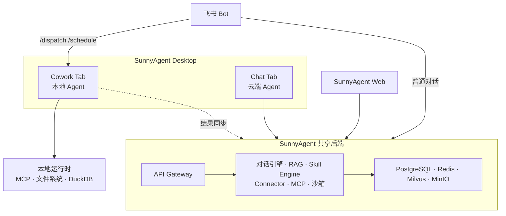
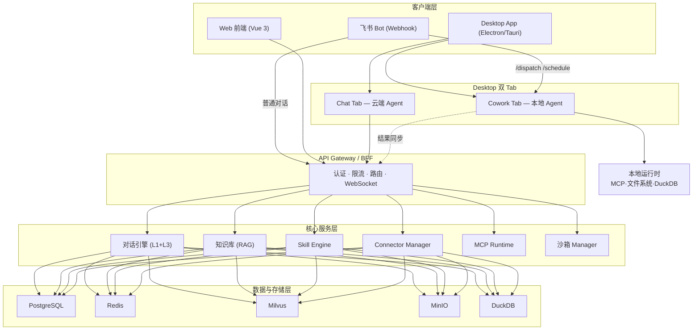

# SunnyAgent 2.0 产品规格说明书

> **版本**：v2.0 | **计划周期**：2026 Q2 | **状态**：规划中
> **子产品**：SunnyAgent Desktop（桌面端）+ SunnyAgent Web（Web端）
> **目标受众**：内部研发团队

---

## 1. 问题陈述

### 1.1 当前痛点

SunnyAgent v1.0 已构建起web版本通用对话、项目管理、定时任务和客诉分析的基础能力，但在企业深度场景落地中暴露出三类核心问题：

**数据孤岛**：v1.0 仅支持 Web 端交互，无法直接访问用户本地文件、本地电脑是企业用户的主要工作场景，不可能把用户电脑文件作为主工作场景。

**知识累积**：v1.0 仅支持文件对话，并没有实现企业知识库，并基于知识库增强模型对员工使用精准度和理解。

**连接断层**：v1.0 支持了飞书和web端交互，无法实现飞书端遥控电脑进行工作，让电脑成为员工的代理，自动执行任务，未来成为真正的数字员工

**质量分析深度不足**：v1.0 的客诉分析仅覆盖"解析 → 提取 → 初步根因"，无法完成 8D/PDCA 报告的自动生成、批次全链路追溯、质量知识的结构化沉淀。质量团队仍然依赖人工编写报告和经验传递，需要深入话

**扩展性瓶颈**：虽然 v1.0 搭建了 Skill/Plugin/SubAgent 框架，但缺乏生态运营机制。业务人员无法自助创建 Skill，Plugin 共建缺乏平台支撑（Hub + Creator），生态启动面临"有框架无内容"的窘境。

### 1.2 影响范围

- **直接用户**：质量部（~30人）、IT部（~100人）、各业务BP（~500人）
- **间接影响**：依赖质量报告的管理层、需要知识库支持的新员工


---

## 2. 产品定位与子产品关系

### 2.1 整体架构



### 2.2 端侧定位差异

| 维度 | SunnyAgent Web | Desktop - Chat Tab | Desktop - Cowork Tab | 飞书 Bot |
|------|---------------|-------------------|---------------------|---------|
| **核心场景** | 团队协作、知识查询、报告查看、Skill 市场 | 与 Web 端一致的对话交互 | 本地文件处理、数据分析、系统集成 | 日常对话 + 遥控桌面端任务 |
| **Agent 执行** | 云端执行 | 云端执行 | **本地执行** | 云端执行 |
| **数据访问** | 通过 API 访问云端数据 | 通过 API 访问云端数据 | 直接访问本地文件 + MCP 桥接 | 通过 API 访问云端数据 |
| **互通方式** | — | 数据与 Web 实时同步 | 结果同步至云端 | 普通对话→Web；`/dispatch` `/schedule`→Desktop |
| **目标用户** | 全体用户（日常交互入口） | 桌面端全体用户 | 数据分析师、质量工程师、IT 管理员 | 全体用户（移动/快速交互） |

### 2.3 共享能力层

两端共享以下核心能力，通过统一后端服务提供：

- **账户与权限**：统一的 JWT + SSO + ABAC 体系，登录状态跨端同步
- **对话引擎**：统一使用agent loop，可以考虑不同语言代码开发，核心逻辑可以共用
- **Skill/Plugin 系统**：同一套 Skill 注册表，两端均可调用
- **企业知识库**：RAG 问答能力对两端统一暴露
- **审计与可观测性**：统一的审计日志和 Prometheus 指标

---

## 3. 目标

### 3.1 用户目标

| # | 目标 | 衡量方式 |
|---|------|---------|
| U1 | 质量工程师能在 Agent 中完成批次全链路追溯，无需手动跨系统查询 | 追溯查询耗时从 30min 降至 < 5min |
| U2 | 质量团队能自动生成 8D/PDCA 报告，减少人工编写时间 | 报告生成时间从 4h 降至 < 30min |
| U3 | 新员工能通过质量知识库快速获得领域知识和历史案例 | 新员工质量相关问题自助解答率 > 60% |
| U4 | 数据分析师能在桌面端直接分析本地 Excel/CSV 文件并生成图表 | 数据分析任务完成率 > 80% |
| U5 | 业务 BP 能通过 Skill Creator 自助创建业务 Skill | BP 独立创建 Skill 成功率 > 70% |

### 3.2 业务目标

| # | 目标 | 衡量方式 |
|---|------|---------|
| B1 | Skills Hub 上线时至少包含 6 个业务领域 Plugin | Plugin 数量 ≥ 6，覆盖质量/HR/IT/财务/供应链/生产 |
| B2 | 桌面端 MAU 达到目标用户群的 40% | 月活跃桌面端用户 / 目标用户总数 |
| B3 | 企业知识库建立质量领域基础知识图谱 | 知识库文档数 > 200，问答准确率 > 75% |
| B4 | v2.0 发布后用户满意度显著提升 | NPS ≥ 40（较 v1.0 提升 ≥ 15 点） |

---

## 4. 非目标（Not In Scope）

| # | 非目标 | 排除原因 |
|---|--------|---------|
| N1 | 移动端（iOS/Android）适配 | 用户主要在工位办公，移动场景优先级低，规划在 v3.0+ 评估 |
| N2 | LangMemory 长期记忆 | 架构复杂度高，v2.0 仅做 RAG 知识库，长期记忆安排在 v3.0 |
| N3 | SPC 统计过程控制 | 需要实时数据接入和统计算法，属于 v3.0 质量全覆盖范畴 |
| N4 | 本体模型构建与知识图谱 | 语义理解层为 v3.0 核心能力，v2.0 聚焦数据连接和 RAG |
| N5 | 多公司部署（3 家子公司覆盖） | v2.0 在本部完成验证后，v3.0 再推广至子公司 |
| N6 | Agent 自进化与 Skill 自动提取 | 属于 v4.0 自适应进化方向，v2.0 聚焦人工 Skill 创建 |

---

## 5. 功能模块详述

### 5.1 模块一：质量深化

#### 5.1.1 质量追溯

**概述**：支持从客诉单号出发，自动串联批次号 → 原材料批次 → 供应商信息 → 生产记录，形成完整追溯链路。

**端侧分布**：
- **Web 端**：追溯结果可视化展示、追溯报告在线查看与分享
- **桌面端**：支持连接本地 ERP/MES 数据源进行追溯查询（通过 Connector）

**用户故事**：

- 作为质量工程师，我想通过输入客诉单号自动获取完整追溯链路，这样我不需要手动在多个系统间切换查询
- 作为质量经理，我想查看某批次的完整追溯树形图，这样我能快速判断影响范围和责任方
- 作为质量工程师，我想将追溯结果一键导出为标准格式报告，这样我能直接用于客户回复

**需求优先级**：

| 优先级 | 需求项 | 验收标准 |
|--------|-------|---------|
| P0 | 批次号 → 原材料 → 供应商的正向追溯 | 输入批次号后 10s 内返回完整追溯链 |
| P0 | 客诉单号 → 批次号的反向追溯 | 支持客诉号自动关联到对应批次 |
| P1 | 追溯结果树形可视化 | 以树状图/时间线展示追溯节点和关系 |
| P1 | 追溯报告导出（PDF/Excel） | 支持标准模板导出，包含关键节点截图 |
| P2 | 批量追溯（多批次并行查询） | 支持上传批次号清单批量追溯 |

**技术依赖**：
- 需要 v1.0 SQL 数据源能力就绪
- 需要 v2.0 Connector 模块提供 ERP/MES 数据接入

#### 5.1.2 8D/PDCA 报告自动生成

**概述**：基于客诉分析结果和追溯数据，自动填充 8D 报告模板各章节，支持人工审核修改后导出。

**端侧分布**：
- **Web 端**：报告在线编辑、协作审核、版本管理
- **桌面端**：报告本地生成与批量处理

**用户故事**：

- 作为质量工程师，我想基于客诉分析结果一键生成 8D 报告草稿，这样我只需审核修改而非从零编写
- 作为质量经理，我想在报告生成过程中看到 AI 的推理依据，这样我能判断报告质量并做必要修正
- 作为质量工程师，我想使用 PDCA 模板记录改善措施和效果验证，这样我能跟踪改善闭环

**需求优先级**：

| 优先级 | 需求项 | 验收标准 |
|--------|-------|---------|
| P0 | 8D 报告自动生成（D1-D8 各节） | 基于客诉数据自动填充各节，准确率 > 70% |
| P0 | 报告模板管理（创建/编辑/设为默认） | 至少支持 8D 和 PDCA 两种标准模板 |
| P0 | 人工审核编辑能力 | 生成后可逐节修改，保留修改历史 |
| P1 | PDCA 循环跟踪 | Plan → Do → Check → Act 各阶段状态流转 |
| P1 | 历史报告检索与对比 | 支持按产品/时间/供应商检索历史报告 |
| P2 | 报告审批工作流 | 多级审核签字流程 |

#### 5.1.3 质量知识库

**概述**：整合质量领域文档、历史案例、标准规范，通过 RAG 技术提供智能问答。同时作为新员工培训的知识入口。

**端侧分布**：
- **Web 端**：知识库浏览、搜索、问答交互（主要入口）
- **桌面端**：本地文档批量导入知识库

**用户故事**：

- 作为新员工，我想通过自然语言询问质量相关问题并获得准确回答和来源引用，这样我能快速上手工作
- 作为质量工程师，我想上传部门的质量标准文档到知识库，这样团队成员都能通过 Agent 查询
- 作为质量经理，我想查看知识库的使用统计（热门问题、未覆盖问题），这样我能持续完善知识内容

**需求优先级**：

| 优先级 | 需求项 | 验收标准 |
|--------|-------|---------|
| P0 | 文档上传与向量化处理 | 支持 PDF/Word/Excel/Markdown，上传后 5min 内可查询 |
| P0 | RAG 问答（带来源引用） | 回答附带原文引用和文档链接，准确率 > 75% |
| P0 | 知识库分类管理 | 支持按领域/文档类型/部门分类组织 |
| P1 | 知识库权限控制 | 基于 ABAC 控制不同角色的知识库访问范围 |
| P1 | 使用分析仪表盘 | 展示热门问题 Top20、未命中查询、知识覆盖率 |
| P2 | 知识库自动更新提醒 | 检测文档过期并提醒维护者更新 |

### 5.2 模块二：数据分析 Agent

**概述**：提供交互式数据分析能力，支持 Excel/CSV/SQL 数据源的加载、分析和可视化。桌面端为数据分析的主阵地。

**端侧分布**：
- **Web 端**：查看分析结果和图表、在线 SQL 查询
- **桌面端**（核心）：本地文件直接分析、云端沙箱代码执行、图表交互编辑

**用户故事**：

- 作为数据分析师，我想直接拖入本地 Excel 文件让 Agent 分析数据分布和趋势，这样我不需要手动清洗和写公式
- 作为质量工程师，我想用自然语言描述分析需求（如"按供应商统计近三月不良率趋势"），Agent 自动生成图表
- 作为业务经理，我想查看 Agent 生成的分析报告并下载为 Excel/PDF，这样我能直接用于汇报

**需求优先级**：

| 优先级 | 需求项 | 验收标准 |
|--------|-------|---------|
| P0 | Excel/CSV 文件加载与预览 | 支持 < 100MB 文件，加载后展示数据概览（行数、列名、类型、缺失率） |
| P0 | 自然语言 → 数据分析（描述性统计、分组聚合、趋势分析） | 正确理解分析意图并返回结果，准确率 > 80% |
| P0 | 图表自动生成（柱状图、折线图、饼图、散点图） | 根据数据特征自动推荐图表类型 |
| P1 | SQL 数据源查询（自然语言 → SQL） | 连接已配置的数据源，NL2SQL 准确率 > 75% |
| P1 | 分析报告导出（Excel + PDF） | 包含数据表、图表、分析结论的完整报告 |
| P1 | 云端沙箱代码执行（Python） | 安全沙箱中执行用户确认的分析代码 |
| P2 | 分析模板（可复用的分析流程） | 保存常用分析流程为模板，一键复用 |

**技术依赖**：
- 桌面端本地文件访问依赖 Electron/Tauri 文件系统 API
- 云端沙箱需选型和部署（候选：E2B、Docker Sandbox）
- SQL 数据源依赖 v1.0 SQL 数据源模块完成

### 5.3 模块三：企业知识库 RAG

**概述**：构建企业级知识库基础设施，支持多种文档格式的向量化存储和 RAG 检索增强生成。

**端侧分布**：
- **Web 端**：知识库管理后台、文档上传 UI、问答交互
- **桌面端**：本地文档批量扫描与导入

**用户故事**：

- 作为 IT 管理员，我想配置知识库的数据源和向量化策略，这样我能根据业务需求优化检索效果
- 作为业务用户，我想在对话中直接引用知识库内容来辅助决策，这样我获得的回答有据可依
- 作为桌面端用户，我想一键扫描指定文件夹将文档批量导入知识库，这样我不需要逐个上传

**需求优先级**：

| 优先级 | 需求项 | 验收标准 |
|--------|-------|---------|
| P0 | 文档向量化引擎（支持 PDF/Word/Markdown/Excel） | 文档上传后完成向量化，支持增量更新 |
| P0 | RAG 检索管线（query → retrieve → rerank → generate） | Recall@10 > 85%，端到端响应 < 3s |
| P0 | 来源引用与溯源 | 回答中标注引用段落和文档来源 |
| P1 | 企业码表集成（主数据映射） | 自动关联企业编码到知识实体（产品、供应商、工序） |
| P1 | 知识库管理后台 | 文档状态监控、向量化进度、存储用量统计 |
| P2 | 试点：历史对话数据分析 | 分析高频问题，辅助知识库内容建设 |

**技术考量**：
- 向量数据库选型：Milvus（自建）或 Qdrant（轻量）
- 分块策略：按段落 + 重叠窗口，支持表格和图片单独分块
- Embedding 模型：BGE-M3 或 text2vec-large-chinese

### 5.4 模块四：桌面端应用

**概述**：将 SunnyAgent 打包为桌面端应用，提供本地文件访问、MCP 协议桥接、离线缓存等 Web 端无法实现的能力。

**用户故事**：

- 作为数据分析师，我想在桌面端直接打开本地的 Excel 文件进行分析，这样我不需要先上传到云端
- 作为质量工程师，我想通过桌面端的 MCP 协议连接 MES 系统查询生产数据，这样我在 Agent 中就能完成追溯
- 作为频繁使用者，我想用全局快捷键随时呼出 Agent 对话窗口，这样我不需要切换应用

**需求优先级**：

| 优先级 | 需求项 | 验收标准 |
|--------|-------|---------|
| P0 | 桌面端打包与分发（Windows + macOS） | 安装包 < 200MB，安装后 30s 内可用 |
| P0 | 本地文件系统访问 | 支持浏览、选择、读取本地文件（需用户授权） |
| P0 | 统一账户登录（SSO 对接） | 与 Web 端共享登录态，无需重复登录 |
| P0 | 自动更新机制 | 支持静默自动更新 + 更新日志展示 |
| P1 | MCP 协议本地桥接 | 通过 MCP 协议连接本地工业系统和工具 |
| P1 | 全局快捷键 + 系统托盘 | Ctrl+Space 唤醒对话窗，系统托盘常驻 |
| P1 | 离线缓存 | 缓存最近 100 条对话和常用知识库问答 |
| P2 | 多窗口模式 | 支持同时打开多个对话/分析窗口 |

**技术决策待定**：

| 决策项 | 选项 A | 选项 B | 评估维度 |
|--------|--------|--------|---------|
| 打包框架 | Electron | Tauri | 包体大小、性能、前端复用率、系统 API 能力 |
| 更新方案 | electron-updater | Tauri updater / Sparkle | 增量更新、签名校验、CDN 分发 |
| 本地存储 | SQLite | LevelDB | 离线数据量、查询复杂度、并发需求 |

### 5.5 模块五：数据 Connector

**概述**：提供统一的数据连接框架，支持对接对象存储、数据库、数据湖等多种数据源。

**端侧分布**：
- **Web 端**：Connector 配置管理界面
- **桌面端**：Connector 运行时（本地桥接，支持内网数据源）

**用户故事**：

- 作为 IT 管理员，我想在 Web 端配置数据源连接（如 MySQL、MinIO），这样 Agent 能查询企业数据
- 作为桌面端用户，我想通过本地 Connector 访问内网 MES 系统数据，这样不需要开放公网访问
- 作为数据分析师，我想在对话中直接查询已连接的数据源，这样我不需要写 SQL 或导出数据

**需求优先级**：

| 优先级 | 需求项 | 验收标准 |
|--------|-------|---------|
| P0 | 统一 Connector 框架（注册、认证、调用） | 新增数据源类型开发周期 < 3 天 |
| P0 | 关系数据库 Connector（MySQL/PostgreSQL） | 连接配置后可通过自然语言查询 |
| P1 | 对象存储 Connector（MinIO/S3） | 文件浏览、下载、元数据查询 |
| P1 | DuckDB 本地分析引擎 | 桌面端内嵌 DuckDB 进行本地数据分析 |
| P2 | 数据湖 Connector（Iceberg） | 查询 Iceberg 表数据 |

### 5.6 模块六：MCP 协议对接

**概述**：实现 Model Context Protocol 标准支持，使 Agent 能连接工业系统和第三方 MCP 工具。

**端侧分布**：
- **桌面端**（核心）：MCP 客户端运行时，连接本地 MCP Server
- **Web 端**：MCP 远程连接（通过代理网关）

**需求优先级**：

| 优先级 | 需求项 | 验收标准 |
|--------|-------|---------|
| P0 | MCP 客户端实现（stdio + SSE 传输） | 符合 MCP 规范，能连接标准 MCP Server |
| P0 | MCP 工具发现与注册 | 自动发现 Server 暴露的工具并注册到 ToolRegistry |
| P1 | MCP 资源读取 | 支持读取 MCP Server 暴露的资源（文件、数据） |
| P1 | 工业系统 MCP 适配器（MES、ERP、QMS） | 至少 2 个工业系统的 MCP Server 适配 |
| P2 | MCP 远程代理网关 | Web 端通过网关连接远程 MCP Server |

### 5.7 模块七：云端沙箱（Web 端 / Chat Tab）

**概述**：采用商业化沙箱服务，为 Web 端和 Desktop Chat Tab 提供安全的远程代码执行环境，主要用于数据分析 Agent 的 Python/SQL 执行。

**技术方向**：选用商业化沙箱（如 E2B、Modal、Daytona），降低自建运维成本，聚焦代码执行体验。

**需求优先级**：

| 优先级 | 需求项 | 验收标准 |
|--------|-------|---------|
| P0 | 商业化沙箱接入（Python 3.10+ 运行时） | 冷启动 < 3s，支持 pandas/matplotlib/seaborn 等常用库 |
| P0 | 代码执行 API 封装 | 统一接口屏蔽底层沙箱差异，支持同步/异步执行 |
| P1 | 会话级沙箱复用 | 同一对话中的代码执行共享沙箱状态和变量 |
| P1 | 执行结果持久化 | 图表、报告等输出文件可下载和预览 |
| P2 | 自定义依赖安装 | 用户可在沙箱中安装额外 Python 包 |
| P2 | 多沙箱供应商切换 | 支持在不同商业化沙箱间平滑切换 |

### 5.8 模块八：桌面沙箱（Cowork Tab）

**概述**：为 Desktop Cowork Tab 提供本地安全隔离的执行环境，Agent 在用户电脑本地执行任务时，确保文件系统和系统资源的安全。

**核心挑战**：Windows 环境下 Agent 直接操作本地文件，需防止误删、越权访问和恶意修改。

**需求优先级**：

| 优先级 | 需求项 | 验收标准 |
|--------|-------|---------|
| P0 | 文件系统沙箱隔离 | Agent 仅可访问用户授权的目录，禁止访问系统目录和敏感路径 |
| P0 | 文件操作审计与确认 | 写入/删除/重命名等破坏性操作需用户确认，操作日志完整记录 |
| P0 | Windows 安全策略集成 | 利用 Windows Sandbox / AppContainer 进行进程级隔离 |
| P1 | 文件版本快照 | Agent 修改文件前自动创建快照，支持一键回滚 |
| P1 | 资源限制 | CPU/内存/磁盘用量上限，防止 Agent 任务失控 |
| P2 | macOS 沙箱适配 | 利用 macOS App Sandbox 实现同等安全保障 |

### 5.9 模块九：Skills Hub 与生态

#### 5.9.1 Skills Hub

**概述**：Skill/Plugin 的在线市场，支持浏览、安装、评分和版本管理。

**端侧分布**：
- **Web 端**：Hub 主界面（浏览、搜索、评分）
- **桌面端**：Hub 集成入口 + 本地 Skill 管理

**需求优先级**：

| 优先级 | 需求项 | 验收标准 |
|--------|-------|---------|
| P0 | Hub 前端页面（分类浏览 + 搜索 + 详情页） | 支持按领域/热度/最新排序 |
| P0 | Skill/Plugin 安装与卸载 | 一键安装后立即可在对话中使用 |
| P1 | 评分与评价系统 | 用户可评分和评价，展示平均分和评价数 |
| P1 | 使用统计（安装量、调用次数、活跃度） | Hub 首页展示热门 Skill 排行 |
| P2 | Skill审核 | 管理员对默认发布到sunny agent skill进行审核后发布 |


#### 5.9.2 BP Plugin 共建

**概述**：联合 6 个业务方向 BP 共建领域 Plugin，目标 v2.0 发布时至少 6 个 Plugin 上线。

| BP 角色 | Plugin 方向 | 核心 Skill | 端侧重点 |
|---------|------------|-----------|---------|
| 质量 BP | 质量管理 | /8d-report, /complaint-analysis, /spc-check | 桌面端（数据分析） |
| HR BP | 人力资源 | /offer-generate, /onboarding-guide, /leave-query | Web 端（协作审批） |
| IT BP | IT 运维 | /incident-report, /change-request, /system-check | 桌面端（系统连接） |
| 财务 BP | 财务分析 | /cost-analysis, /budget-report, /expense-check | Web 端（报告查看） |
| 供应链 BP | 采购与供应链 | /supplier-evaluate, /delivery-track, /inventory-alert | 两端均衡 |
| 生产 BP | 生产管理 | /production-report, /yield-analysis, /shift-handover | 桌面端（MCP 接入） |

---

## 6. 成功指标

### 6.1 先行指标（发布后 1-4 周）

| 指标 | 目标值 | 测量方式 |
|------|-------|---------|
| 桌面端安装率 | 目标用户群 60% 安装 | 下载/安装统计 |
| 知识库文档导入量 | > 200 篇 | 知识库管理后台统计 |
| Skills Hub 访问量 | DAU > 30 | Hub 前端埋点 |
| 8D 报告生成次数 | > 20 份/月 | Agent 调用日志 |
| Skill Creator 使用次数 | > 10 次/月 | 创建流程完成率统计 |

### 6.2 滞后指标（发布后 1-3 月）

| 指标 | 目标值 | 测量方式 |
|------|-------|---------|
| 质量报告编写时间 | 降低 > 50% | 用户调研 + 报告生成耗时统计 |
| 新员工自助问答解决率 | > 60% | 知识库问答日志 + 用户反馈 |
| 桌面端 MAU | > 40% 目标用户 | 月活跃用户统计 |
| Plugin 数量 | ≥ 6 个上线 | Skills Hub 统计 |
| NPS 评分 | ≥ 40 | 季度用户满意度调研 |

---

## 7. 技术架构概要

### 7.1 系统架构



### 7.2 新增核心组件（待定）

| 组件 | 职责 | 技术选型 |
|------|------|---------|
| RAG Pipeline | 文档向量化 + 检索 + 重排 + 生成 | LangChain / LlamaIndex + BGE-M3 |
| Vector Store | 向量存储与相似度检索 | Milvus 或 Qdrant（待评估） |
| Connector Manager | 统一数据源连接管理 | 自研框架 + 适配器模式 |
| MCP Runtime | MCP 协议客户端运行时 | 基于 MCP SDK 实现 |
| Sandbox Manager | 安全代码执行环境管理 | E2B / Docker Sandbox（待评估） |
| Desktop Shell | 桌面端应用壳 | Electron 或 Tauri（待评估） |
| Skills Hub Backend | Skill 注册、版本、评分 API | 扩展现有 Plugin 管理模块 |

---

## 8. 模块分工

| 模块 | 内容 | 责任人 | 优先级 | 备注 |
|------|------|--------|--------|------|
| 一、质量深化 | 追溯 + 8D/PDCA 报告 + 质量知识库 | 阿斌 + 1| P0 | 依赖 Connector 和 RAG |
| 二、数据分析 Agent | 本地文件分析与图表生成 | 待定 | P0 | 桌面端核心场景 |
| 三、企业知识库 RAG | 文档向量化 + 检索管线 | 阿斌 | P0 | 基础设施模块 |
| 四、桌面端应用 | Desktop 打包（Chat + Cowork 双 Tab） | 爽佃 + 前端 +1 | P0 | 阻塞：框架选型 Q1 |
| 五、数据 Connector | 统一数据源连接框架 | 待定 | P0 | 质量追溯前置依赖 |
| 六、MCP 协议对接 | MCP 客户端 + 工业系统适配 | 待定 | P1 | Cowork Tab 核心 |
| 七、云端沙箱 | 商业化沙箱接入（代码执行） | 赵毅 | P0 | Web 端 + Chat Tab |
| 八、桌面沙箱 | 本地沙箱（文件安全隔离） | 爽佃 | P0 | 阻塞：方案选型 Q4 |
| 九、Skills Hub 与生态 | Skill 市场 + BP Plugin 共建 | 娇老板 | P0 | — |

---

## 9. 开放问题

| # | 问题 | 负责方 | 责任人 | 是否阻塞 |
|---|------|--------|--------|---------|
| Q1 | 桌面端打包框架和语言选择？需评估包体大小、性能和前端复用率 | 架构组 | 待定 | 阻塞（开发启动前需决策） |
| Q2 | 向量数据库选型 Milvus vs Qdrant？需评估运维成本、性能和集群扩展性 | 架构组 | 待定 | 阻塞（RAG 模块启动前需决策） |
| Q3 | 云端沙箱方案选型 E2B vs Docker Sandbox vs 自建？需评估安全性、成本和冷启动时间 | 架构组 | 待定 | 半阻塞（可先用 Docker，后续优化） |
| Q4 | 桌面沙箱方案选型？需评估安全性、成本和冷启动时间 | 架构组 | 待定 | 阻塞，文件安全是关键问题 |
| Q5 | 质量知识库的初始内容由谁负责整理和上传？ | 质量部 + 产品组 | 待定 | 非阻塞（可并行准备） |
| Q6 | BP Plugin 共建的 BP 人选确认和培训计划 | 产品组 + 各业务线 | 待定 | 非阻塞（可在 Q2 初期完成） |


---

## 10. 时间线考量

### 10.1 里程碑规划

```
2026-04                    2026-05                    2026-06
   │                          │                          │
   ▼                          ▼                          ▼
┌──────────┐           ┌──────────┐           ┌──────────┐
│ M1: 基建  │           │ M2: 核心  │           │ M3: 集成  │
│ 4月初-中旬 │           │ 4月下旬-5月│           │ 6月       │
└──────────┘           └──────────┘           └──────────┘

M1 基建期（2-3周）:
 · 技术选型决策（Q1-Q3）
 · 桌面端脚手架搭建
 · RAG 基础管线搭建
 · Connector 框架搭建

M2 核心功能期（4-5周）:
 · 质量追溯 + 8D 报告
 · 企业知识库 RAG
 · 数据分析 Agent
 · Skills Hub + Skill Creator
 · MCP 协议实现

M3 集成与发布（3-4周）:
 · 端侧集成联调
 · BP Plugin 共建冲刺
 · 性能测试与安全审查
 · 内测 + Bug 修复
 · 正式发布 + 内部推广
```

### 10.2 风险项

| 风险 | 影响 | 缓解措施 |
|------|------|---------|
| Electron/Tauri 选型延迟 | 桌面端开发无法启动 | 设置选型截止日期（4月第1周），超期默认 Electron |
| RAG 检索质量不达标 | 知识库体验差，用户不信任 | 提前做 benchmark，准备多种分块 + 检索策略 |
| MES/ERP 接口对接困难 | 质量追溯无法完整串联 | P0 先支持手动数据导入，P1 实现系统对接 |
| BP 投入度不足 | Plugin 数量不达标 | 产品团队提供模板和辅导，降低 BP 创建门槛 |

---

## 附录 A：术语表

| 术语 | 定义 |
|------|------|
| MCP | Model Context Protocol，模型上下文协议，用于 Agent 与外部工具/数据源通信 |
| RAG | Retrieval-Augmented Generation，检索增强生成，结合知识库检索提升回答质量 |
| 8D | 八纪律报告，制造业标准的问题解决方法论 |
| PDCA | Plan-Do-Check-Act，戴明循环，持续改善方法 |
| Skill | SunnyAgent 中的可复用能力单元，包含 prompt + 工具配置 |
| Plugin | 多个 Skill 的打包集合，面向特定业务领域 |
| Connector | 数据源连接器，用于对接外部数据库和系统 |
| BP | Business Partner，各业务线的对接人/顾问角色 |
| ABAC | Attribute-Based Access Control，基于属性的访问控制 |
| NL2SQL | Natural Language to SQL，自然语言转 SQL 查询 |
