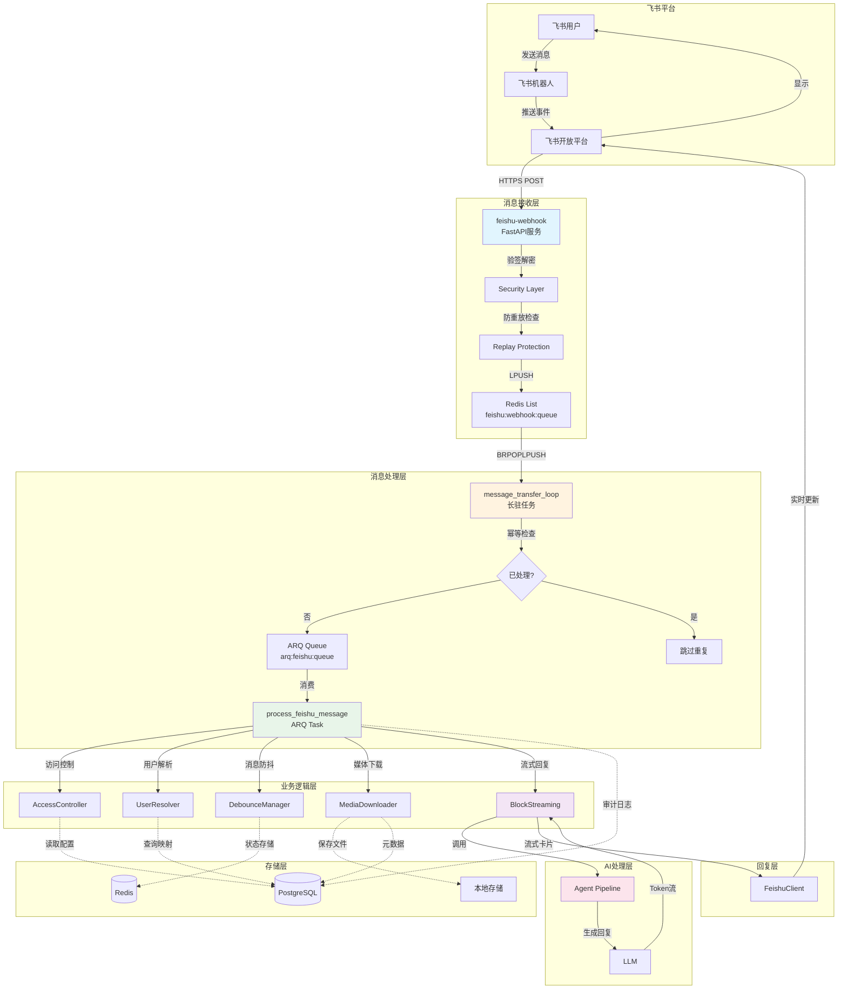
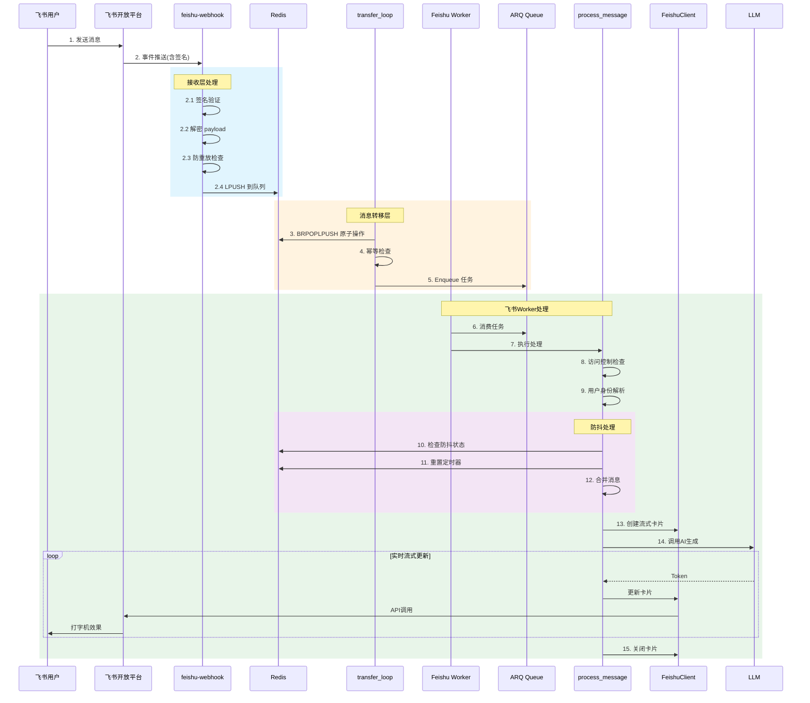
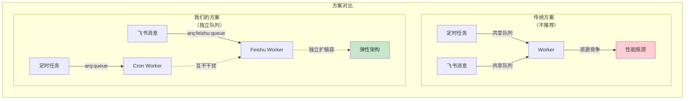
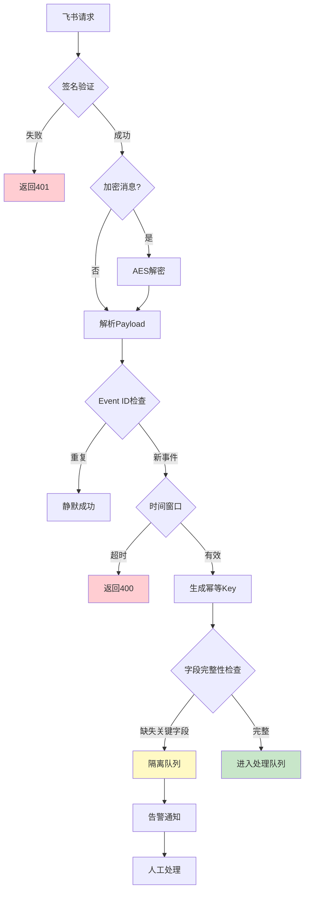
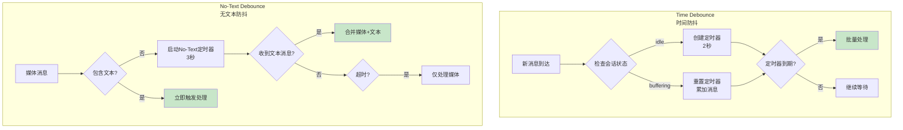
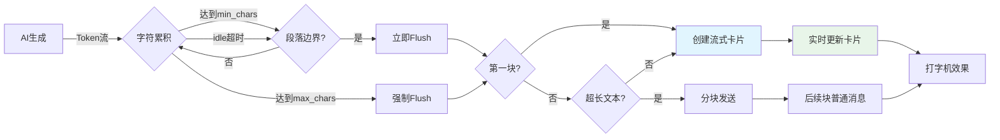
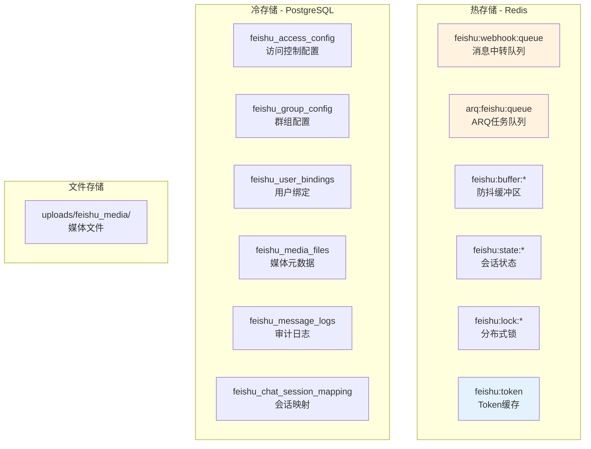
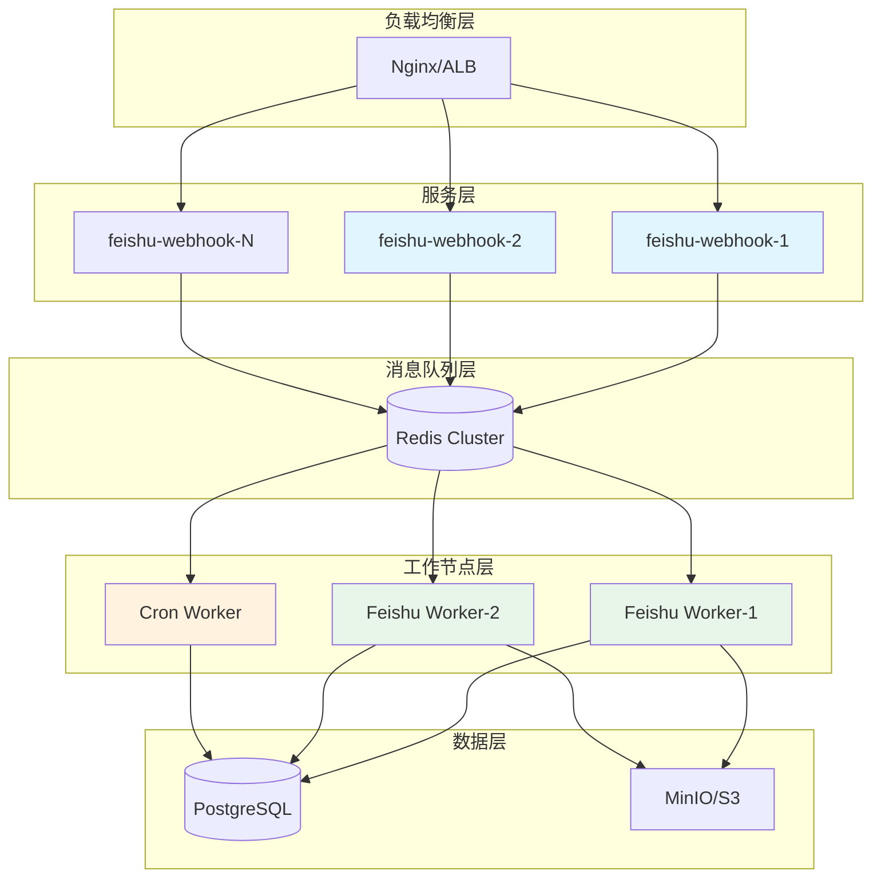
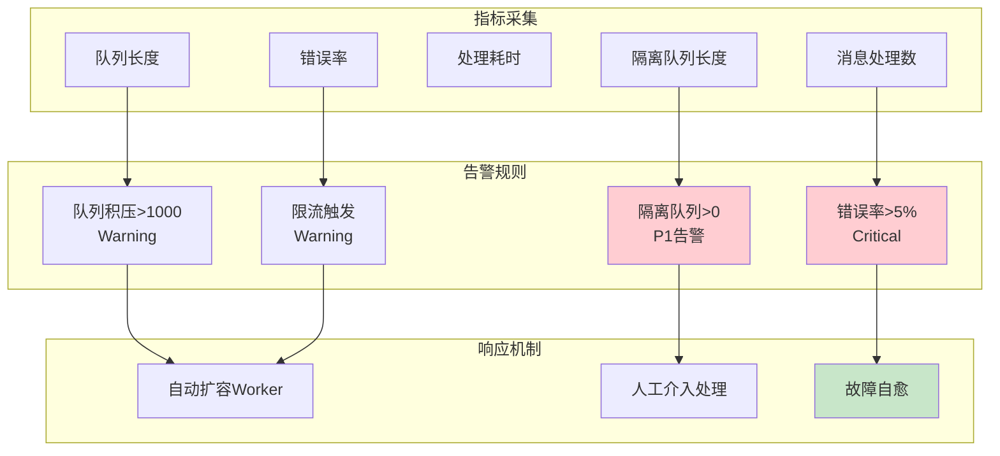
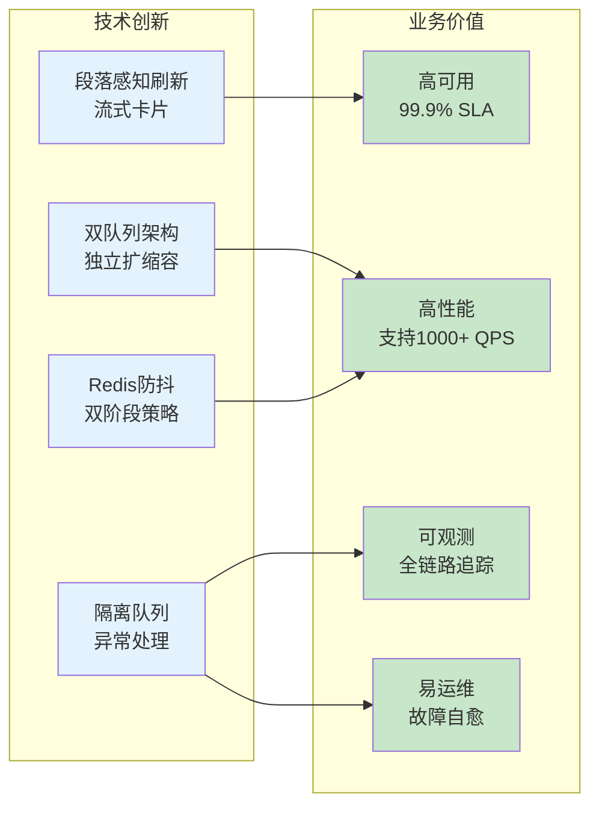

# 飞书 ARQ 集成架构流程图

> 用于领导汇报的架构设计演示材料

---

## 一、整体架构全景图

---

## 二、消息流转时序图

---

## 三、双队列架构对比

---

## 四、安全控制流程

---

## 五、防抖机制流程

---

## 六、BlockStreaming 流式回复

---

## 七、数据存储架构

---

## 八、部署架构

---

## 九、监控告警体系

---

## 十、核心创新点总结

---

## 汇报要点提示

1. **架构先进性**
   - 采用独立队列架构，避免资源竞争
   - BRPOPLPUSH 原子操作保证消息不丢失
   - 幂等设计防止重复处理

2. **用户体验**
   - BlockStreaming 流式卡片，实时打字机效果
   - 段落感知刷新，保持内容完整性
   - 防抖机制智能合并连续消息

3. **安全合规**
   - 多层安全校验（签名、加密、防重放）
   - 访问控制策略（白名单、禁用、开放）
   - 完整审计日志记录

4. **运维友好**
   - 完善的监控告警体系
   - 故障自愈能力
   - 水平扩展支持

5. **性能指标**
   - 消息处理延迟：< 4秒（含防抖）
   - 支持并发：1000+ QPS
   - 可用性：99.9% SLA

6. **风险控制**
   - 隔离队列处理异常消息
   - 自动降级策略
   - 完善的回滚方案

---

**文档版本**: v1.0  
**创建日期**: 2026-03-12  
**适用场景**: 技术方案评审、架构汇报、团队分享
